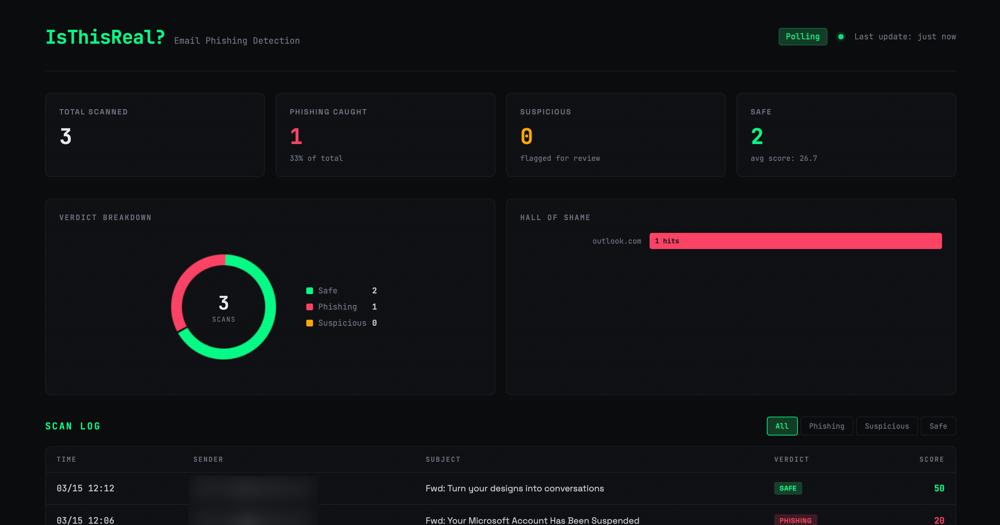

# Is This Real?

AI-powered email phishing detection. Forward a suspicious email, get a plain-English verdict.

## What it does

- Monitors a shared mailbox via Microsoft Graph API for forwarded emails
- Extracts the original sender and content from forwarded messages (Outlook, Gmail, Apple Mail, Yahoo)
- Runs deterministic checks: sender typosquat detection, SPF/DKIM/DMARC validation, link mismatch analysis, HTTP link flagging, urgency language patterns, credential harvesting detection, dangerous attachment flagging
- Sends findings to Claude for a plain-language verdict at a 6th-grade reading level
- Replies with a red/yellow/green risk assessment explaining each finding in plain English
- Claude acts as the final word on risk level — overrides false positives from automated checks
- Score-based API gating — clean emails never hit the API, keeping costs near zero
- Logs every scan to SQLite and serves a live dashboard with verdict breakdown, scan log, top flagged domains, and common detection signals



## Requirements

- Python 3.11+
- Microsoft 365 tenant with an app registration
- Anthropic API key

## Setup

### 1. Clone the repo

```bash
git clone https://github.com/nickrinke/IsThisReal.git
cd IsThisReal
```

### 2. Install dependencies

```bash
pip install -r requirements.txt
```

### 3. Create an app registration in Entra

1. Go to [Entra Admin Center](https://entra.microsoft.com) > App registrations > New registration
2. Name it `IsThisReal`, single tenant, no redirect URI
3. Under API permissions > Add a permission > Microsoft Graph > Application permissions, add:
   - `Mail.ReadWrite`
   - `Mail.Send`
4. Grant admin consent
5. Go to Certificates & secrets > New client secret, copy the value immediately

### 4. Create a shared mailbox

Create a shared mailbox (e.g., `isthisreal@yourdomain.com`) in Exchange admin center. No license required.

### 5. Scope permissions to the mailbox

```powershell
Connect-ExchangeOnline
New-DistributionGroup -Name "IsThisReal Access" -Type Security -Members "isthisreal@yourdomain.com"
New-ApplicationAccessPolicy -AppId "YOUR_CLIENT_ID" -PolicyScopeGroupId "IsThisReal Access" -AccessRight RestrictAccess -Description "IsThisReal mailbox only"
```

### 6. Configure credentials

Create a `.env` file in the project root:

```
AZURE_TENANT_ID=your-tenant-id
AZURE_CLIENT_ID=your-client-id
AZURE_CLIENT_SECRET=your-client-secret
ISTHISREAL_MAILBOX=isthisreal@yourdomain.com
ANTHROPIC_API_KEY=your-anthropic-api-key
```

> ⚠️ Never commit `.env` to version control. It is included in `.gitignore`.

## Usage

Run in poll mode (production):

```bash
python -m isthisreal
```

Run in server mode (development — test endpoint, no mailbox needed):

```bash
python -m isthisreal --server
```

Test the analysis engine locally:

```bash
curl -X POST http://localhost:8000/test/analyze \
  -H "Content-Type: application/json" \
  -d '{
    "sender_address": "support@mikerosoct.net",
    "subject": "Your Microsoft Account Needs Attention",
    "body_plain": "Your account will be suspended in 24 hours. Click here to verify your identity immediately.",
    "spf_result": "fail"
  }'
```

## Docker

```bash
docker build -t isthisreal .
docker run -d --restart unless-stopped --env-file .env --name isthisreal isthisreal
```

## Supported Environments

| Environment | Graph Base URL | Authority Host |
|-------------|---------------|----------------|
| Commercial | `https://graph.microsoft.com` | `https://login.microsoftonline.com` |
| GCC | `https://graph.microsoft.com` | `https://login.microsoftonline.com` |
| GCC-High | `https://graph.microsoft.us` | `https://login.microsoftonline.us` |

## Project Structure

```
IsThisReal/
├── isthisreal/
│   ├── auth.py        # MSAL authentication, token acquisition
│   ├── graph.py       # Microsoft Graph API calls, email parsing
│   ├── forward.py     # Forwarded email extraction (Outlook, Gmail, Apple Mail, Yahoo)
│   ├── analyzer.py    # Deterministic phishing checks
│   ├── verdict.py     # Claude integration and plain-language synthesis
│   ├── reply.py       # HTML verdict email builder
│   ├── models.py      # Pydantic models
│   ├── config.py      # Settings via pydantic-settings
│   └── main.py        # Poll loop and FastAPI test server
├── tests/
│   ├── test_analyzer.py
│   └── test_forward.py
├── Dockerfile
├── requirements.txt
└── .env               # Credentials (not committed)
```

## Tech Stack

- [MSAL](https://github.com/AzureAD/microsoft-authentication-library-for-python) — Microsoft authentication
- [Requests](https://requests.readthedocs.io/) — HTTP client for Graph API calls
- [Pydantic](https://docs.pydantic.dev/) — Data validation and settings
- [Anthropic Python SDK](https://github.com/anthropic/anthropic-sdk-python) — Claude integration
- [FastAPI](https://fastapi.tiangolo.com/) — Test server for local development
- [BeautifulSoup](https://www.crummy.com/software/BeautifulSoup/) — HTML parsing and link extraction
- [python-Levenshtein](https://github.com/rapidfuzz/python-Levenshtein) — Typosquat detection

## License

MIT
